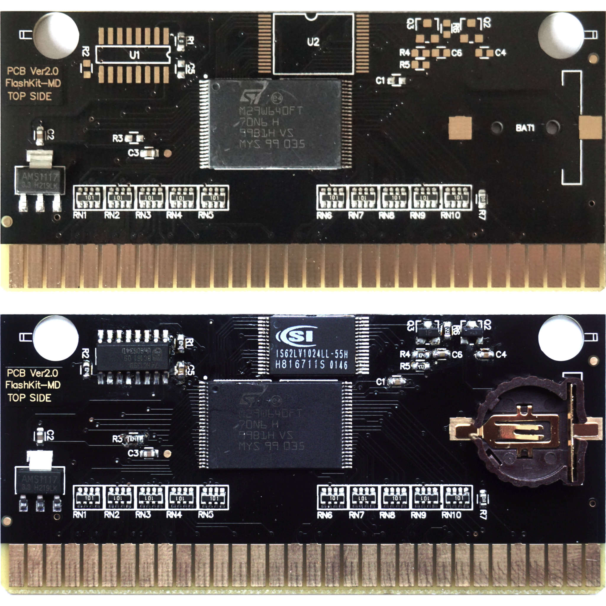

[FlashKit-MD clone from AliExpress](https://www.aliexpress.com/item/1005001515149225.html)  can be modded to include battery backed SRAM.

It was tested with Wolfenstein 3d (homebrew) and Sonic 3.

Please be aware that it is possible that it will restrict ROM size to just 2 MB (instead of 4).

Parts for the save function:
----------------------------

R1  100K (replace 0R)  
R2  100K  
R3  100K  
R4  100K  
R5  4K7  
R6  22K  

C1  100n  
C4  100n  
C5  100n  
C6  100n  

U1  74HC139D  
U2  IS62LV1024LL-55H  

Q2  BAT54C  
Q3  MMBT2222A  

BAT1 CR1220 Holder  

Board before and after the mod:
-------------------------------

